# Entity-Relationship Diagram (ERD) — GSports

> Tài liệu mô tả toàn bộ các thực thể (Entity), thuộc tính (Attribute) và quan hệ (Relationship)
> trong hệ thống **quản lý sân thể thao GSports**.

---

## Mục lục

1. [Tổng quan kiến trúc dữ liệu](#1-tổng-quan-kiến-trúc-dữ-liệu)
2. [Module AUTH & USER](#2-module-auth--user)
3. [Module VENUE & SPORTS](#3-module-venue--sports)
4. [Module BOOKING](#4-module-booking)
5. [Module PAYMENT](#5-module-payment)
6. [Module SERVICE / KIOSK](#6-module-service--kiosk)
7. [Module REVIEW](#7-module-review)
8. [Module CHAT REALTIME](#8-module-chat-realtime)
9. [Module STAFF](#9-module-staff)
10. [Module ANALYTICS](#10-module-analytics)
11. [Module SYSTEM](#11-module-system)
12. [Sơ đồ ERD (Mermaid)](#12-sơ-đồ-erd-mermaid)
13. [Cây quan hệ tổng quan](#13-cây-quan-hệ-tổng-quan)
14. [Ràng buộc CHECK](#14-ràng-buộc-check)
15. [Ghi chú kỹ thuật](#15-ghi-chú-kỹ-thuật)

---

## 1. Tổng quan kiến trúc dữ liệu

Hệ thống được chia thành **9 module** nghiệp vụ, ánh xạ trực tiếp sang các Django app:

| Module | Django App | Mô tả |
|--------|------------|--------|
| Auth & User | `accounts/` | Quản lý người dùng, vai trò, ví, thông báo |
| Venue & Sports | `venues/` | Quản lý cơ sở, sân, giá, chính sách, môn thể thao |
| Booking | `bookings/` | Đặt sân, slot, khoá slot, khuyến mãi |
| Payment | `payments/` | Thanh toán, hoá đơn, mã khuyến mãi |
| Service / Kiosk | `services/` | Dịch vụ phụ trợ (nước, dụng cụ…) |
| Review | `reviews/` (hoặc `venues/`) | Đánh giá cơ sở |
| Chat Realtime | `chat/` | Nhắn tin thời gian thực |
| Staff | `venues/` (hoặc `staff/`) | Quản lý nhân viên sân, ca làm việc |
| Analytics | `analytics/` | Thống kê doanh thu, lượng booking |
| System | `core/` | Audit log, sự kiện hệ thống |

---

## 2. Module AUTH & USER

### 2.1. User

| Cột | Kiểu | Ràng buộc | Mô tả |
|-----|------|-----------|-------|
| `id` | BigInt | **PK**, Auto Increment | Khoá chính |
| `username` | Varchar | Unique, Not Null | Tên đăng nhập |
| `email` | Varchar | Unique, Not Null | Email |
| `password` | Varchar | Not Null | Mật khẩu (hashed) |
| `phone` | Varchar | Nullable | Số điện thoại |
| `avatar` | ImageField | Nullable | Ảnh đại diện |
| `is_active` | Boolean | Default `True` | Trạng thái tài khoản |
| `date_joined` | DateTime | Auto | Ngày tạo tài khoản |
| `updated_at` | DateTime | Auto (auto_now) | Thời gian cập nhật cuối |

### 2.2. Role

| Cột | Kiểu | Ràng buộc | Mô tả |
|-----|------|-----------|-------|
| `id` | BigInt | **PK** | Khoá chính |
| `name` | Varchar | Unique, Not Null | Tên vai trò |

**Giá trị enum:** `CUSTOMER`, `OWNER`, `STAFF`, `ADMIN`

### 2.3. UserRole

| Cột | Kiểu | Ràng buộc | Mô tả |
|-----|------|-----------|-------|
| `id` | BigInt | **PK** | Khoá chính |
| `user_id` | BigInt | **FK → User** | Người dùng |
| `role_id` | BigInt | **FK → Role** | Vai trò |

> **Index:** Composite Unique trên `(user_id, role_id)` để tránh gán trùng vai trò.

### 2.4. OwnerProfile

| Cột | Kiểu | Ràng buộc | Mô tả |
|-----|------|-----------|-------|
| `id` | BigInt | **PK** | Khoá chính |
| `user_id` | BigInt | **FK → User**, Unique | Liên kết 1-1 với User |
| `business_name` | Varchar | Not Null | Tên doanh nghiệp |
| `bank_account_number` | Varchar | Nullable | Số tài khoản ngân hàng |
| `bank_name` | Varchar | Nullable | Tên ngân hàng |
| `is_verified` | Boolean | Default `False` | Trạng thái xác minh |

### 2.5. CustomerProfile

| Cột | Kiểu | Ràng buộc | Mô tả |
|-----|------|-----------|-------|
| `id` | BigInt | **PK** | Khoá chính |
| `user_id` | BigInt | **FK → User**, Unique | Liên kết 1-1 với User |
| `loyalty_points` | Integer | Default `0` | Điểm tích luỹ |

### 2.6. Wallet

| Cột | Kiểu | Ràng buộc | Mô tả |
|-----|------|-----------|-------|
| `id` | BigInt | **PK** | Khoá chính |
| `user_id` | BigInt | **FK → User**, Unique | Liên kết 1-1 với User |
| `balance` | Decimal | Default `0`, CHECK ≥ 0 | Số dư ví |

### 2.7. WalletTransaction

| Cột | Kiểu | Ràng buộc | Mô tả |
|-----|------|-----------|-------|
| `id` | UUID | **PK** | Khoá chính (UUID) |
| `wallet_id` | BigInt | **FK → Wallet** | Ví liên kết |
| `transaction_type` | Varchar | Not Null | Chiều giao dịch |
| `sub_total` | Decimal | Not Null | Số tiền trước xử lý |
| `final_amount` | Decimal | Not Null | Số tiền cuối cùng |
| `reference_type` | Varchar | Not Null | Loại tham chiếu |
| `reference_id` | BigInt/UUID | Not Null | ID tham chiếu |
| `status` | Varchar | Not Null | Trạng thái giao dịch |
| `description` | Text | Nullable | Mô tả |
| `created_at` | DateTime | Auto | Thời gian tạo |

**Giá trị `transaction_type`:** `CREDIT` (tiền vào), `DEBIT` (tiền ra)
**Giá trị `reference_type`:** `BOOKING`, `REFUND`, `TOPUP`, `REWARD`

### 2.8. Notification

| Cột | Kiểu | Ràng buộc | Mô tả |
|-----|------|-----------|-------|
| `id` | BigInt | **PK** | Khoá chính |
| `user_id` | BigInt | **FK → User** | Người nhận |
| `title` | Varchar | Not Null | Tiêu đề |
| `content` | Text | Not Null | Nội dung |
| `entity_type` | Varchar | Nullable | Loại thực thể liên quan |
| `entity_id` | BigInt/UUID | Nullable | ID thực thể liên quan |
| `type` | Varchar | Not Null | Kênh gửi |
| `is_read` | Boolean | Default `False` | Đã đọc chưa |
| `created_at` | DateTime | Auto | Thời gian tạo |

**Giá trị `type`:** `EMAIL`, `PUSH`, `INAPP`

### 2.9. FavoriteVenue

| Cột | Kiểu | Ràng buộc | Mô tả |
|-----|------|-----------|-------|
| `id` | BigInt | **PK** | Khoá chính |
| `user_id` | BigInt | **FK → User** | Người dùng |
| `venue_id` | BigInt | **FK → Venue** | Cơ sở yêu thích |
| `created_at` | DateTime | Auto | Thời gian thêm |

> **Index:** Composite Unique trên `(user_id, venue_id)`.

---

## 3. Module VENUE & SPORTS

### 3.1. Sport

| Cột | Kiểu | Ràng buộc | Mô tả |
|-----|------|-----------|-------|
| `id` | BigInt | **PK** | Khoá chính |
| `name` | Varchar | Unique, Not Null | Tên môn thể thao (VD: Bóng đá, Cầu lông, Tennis, Pickleball) |
| `slug` | SlugField | Unique, Not Null | Slug cho URL |
| `icon` | Varchar | Nullable | Icon hiển thị |
| `description` | Text | Nullable | Mô tả |
| `is_active` | Boolean | Default `True` | Trạng thái hoạt động |

### 3.2. Venue

| Cột | Kiểu | Ràng buộc | Mô tả |
|-----|------|-----------|-------|
| `id` | BigInt | **PK** | Khoá chính |
| `owner_id` | BigInt | **FK → OwnerProfile** | Chủ sở hữu |
| `name` | Varchar | Not Null | Tên cơ sở |
| `description` | Text | Nullable | Mô tả |
| `address` | Varchar | Not Null | Địa chỉ |
| `latitude` | Decimal | Nullable | Vĩ độ |
| `longitude` | Decimal | Nullable | Kinh độ |
| `status` | Varchar | Not Null | Trạng thái hoạt động |
| `is_deleted` | Boolean | Default `False` | Soft delete |
| `deleted_at` | DateTime | Nullable | Thời gian xoá |
| `updated_at` | DateTime | Auto (auto_now) | Thời gian cập nhật cuối |

### 3.3. VenueOperatingHour

| Cột | Kiểu | Ràng buộc | Mô tả |
|-----|------|-----------|-------|
| `id` | BigInt | **PK** | Khoá chính |
| `venue_id` | BigInt | **FK → Venue** | Cơ sở |
| `weekday` | SmallInt | Not Null (0-6) | Thứ trong tuần |
| `open_time` | Time | Not Null | Giờ mở cửa |
| `close_time` | Time | Not Null | Giờ đóng cửa |

> **Index:** Composite Unique trên `(venue_id, weekday)`.
> **CHECK:** `close_time > open_time`

### 3.4. VenueImage

| Cột | Kiểu | Ràng buộc | Mô tả |
|-----|------|-----------|-------|
| `id` | BigInt | **PK** | Khoá chính |
| `venue_id` | BigInt | **FK → Venue** | Cơ sở |
| `image` | ImageField | Not Null | Ảnh |
| `is_thumbnail` | Boolean | Default `False` | Có phải ảnh đại diện không |
| `sort_order` | Integer | Default `0` | Thứ tự hiển thị |

### 3.5. FieldType

| Cột | Kiểu | Ràng buộc | Mô tả |
|-----|------|-----------|-------|
| `id` | BigInt | **PK** | Khoá chính |
| `sport_id` | BigInt | **FK → Sport** | Môn thể thao |
| `name` | Varchar | Not Null | Tên loại sân (VD: Sân 5, Sân 7, Sân đơn, Sân đôi) |
| `slug` | SlugField | Unique, Not Null | Slug cho URL |
| `icon` | Varchar | Nullable | Icon hiển thị |
| `description` | Text | Nullable | Mô tả |
| `player_count` | Integer | Not Null | Số người chơi tiêu chuẩn |
| `status` | Varchar | Not Null | Trạng thái |

> **Index:** Composite Unique trên `(sport_id, name)` — cùng 1 môn không có 2 loại sân trùng tên.

### 3.6. Field

| Cột | Kiểu | Ràng buộc | Mô tả |
|-----|------|-----------|-------|
| `id` | BigInt | **PK** | Khoá chính |
| `venue_id` | BigInt | **FK → Venue** | Thuộc cơ sở nào |
| `field_type_id` | BigInt | **FK → FieldType** | Loại sân |
| `name` | Varchar | Not Null | Tên sân |
| `capacity` | Integer | Nullable | Sức chứa |
| `surface_type` | Varchar | Nullable | Loại mặt sân (cỏ nhân tạo, cỏ tự nhiên…) |
| `length` | Decimal | Nullable | Chiều dài (m) |
| `width` | Decimal | Nullable | Chiều rộng (m) |
| `status` | Varchar | Not Null | Trạng thái |

### 3.7. FieldPriceRule

| Cột | Kiểu | Ràng buộc | Mô tả |
|-----|------|-----------|-------|
| `id` | BigInt | **PK** | Khoá chính |
| `field_id` | BigInt | **FK → Field** | Sân áp dụng |
| `day_of_week` | SmallInt | Nullable | Ngày trong tuần (null = tất cả) |
| `start_time` | Time | Not Null | Giờ bắt đầu khung giá |
| `end_time` | Time | Not Null | Giờ kết thúc khung giá |
| `price_per_hour` | Decimal | Not Null | Giá mỗi giờ |
| `start_date` | Date | Nullable | Ngày bắt đầu hiệu lực |
| `end_date` | Date | Nullable | Ngày kết thúc hiệu lực |
| `priority` | Integer | Default `0` | Độ ưu tiên (cao hơn = ưu tiên) |
| `is_holiday` | Boolean | Default `False` | Áp dụng ngày lễ |
| `special_event` | Varchar | Nullable | Sự kiện đặc biệt |

> **CHECK:** `end_time > start_time`, `end_date >= start_date` (khi cả hai đều không null)

### 3.8. VenuePolicy

| Cột | Kiểu | Ràng buộc | Mô tả |
|-----|------|-----------|-------|
| `id` | BigInt | **PK** | Khoá chính |
| `venue_id` | BigInt | **FK → Venue**, Unique | Cơ sở (1-1) |
| `cancel_before_hours` | Integer | Not Null | Số giờ tối thiểu để huỷ |
| `refund_percent` | Decimal | Not Null, CHECK 0-100 | Phần trăm hoàn tiền |

---

## 4. Module BOOKING

### 4.1. BookingPackage

| Cột | Kiểu | Ràng buộc | Mô tả |
|-----|------|-----------|-------|
| `id` | UUID | **PK** | Khoá chính (UUID) |
| `user_id` | BigInt | **FK → User** | Người đặt |
| `package_type` | Varchar | Not Null | Loại gói |
| `start_date` | Date | Not Null | Ngày bắt đầu |
| `end_date` | Date | Nullable | Ngày kết thúc (null nếu single) |
| `created_at` | DateTime | Auto | Thời gian tạo |
| `updated_at` | DateTime | Auto (auto_now) | Thời gian cập nhật cuối |
| `refund_amount_applied` | Decimal | Default `0` | Số tiền đã hoàn |

**Giá trị `package_type`:** `SINGLE`, `RECURRING`

> **CHECK:** `end_date >= start_date` (khi `end_date` không null)

### 4.2. BookingRecurrenceDay

| Cột | Kiểu | Ràng buộc | Mô tả |
|-----|------|-----------|-------|
| `id` | BigInt | **PK** | Khoá chính |
| `booking_package_id` | UUID | **FK → BookingPackage** | Gói đặt sân |
| `weekday` | SmallInt | Not Null (0-6) | Ngày lặp lại trong tuần |

### 4.3. Booking

| Cột | Kiểu | Ràng buộc | Mô tả |
|-----|------|-----------|-------|
| `id` | UUID | **PK** | Khoá chính (UUID) |
| `booking_package_id` | UUID | **FK → BookingPackage** | Thuộc gói nào |
| `venue_id` | BigInt | **FK → Venue** | Cơ sở (denormalized) |
| `field_id` | BigInt | **FK → Field** | Sân được đặt |
| `booking_date` | Date | Not Null | Ngày sử dụng sân |
| `status` | Varchar | Not Null | Trạng thái |
| `booking_channel` | Varchar | Not Null | Kênh đặt |
| `total_amount` | Decimal | Not Null | Tổng tiền |
| `payment_deadline` | DateTime | Nullable | Hạn thanh toán |
| `note` | Text | Nullable | Ghi chú |
| `created_at` | DateTime | Auto | Thời gian tạo |
| `updated_at` | DateTime | Auto (auto_now) | Thời gian cập nhật cuối |

**Giá trị `status`:** `PENDING`, `PAID`, `WAITING`, `CANCELLED`
**Giá trị `booking_channel`:** `WEB`, `WALKIN`

> `venue_id` là denormalized FK — giá trị phải luôn khớp với `Field.venue_id`. Validate ở tầng application hoặc trigger.

### 4.4. BookingSlot

| Cột | Kiểu | Ràng buộc | Mô tả |
|-----|------|-----------|-------|
| `id` | BigInt | **PK** | Khoá chính |
| `booking_id` | UUID | **FK → Booking** | Booking liên kết |
| `start_time` | Time | Not Null | Giờ bắt đầu |
| `end_time` | Time | Not Null | Giờ kết thúc |
| `price` | Decimal | Not Null | Giá slot này |

> **CHECK:** `end_time > start_time`

### 4.5. SlotLock

| Cột | Kiểu | Ràng buộc | Mô tả |
|-----|------|-----------|-------|
| `id` | BigInt | **PK** | Khoá chính |
| `field_id` | BigInt | **FK → Field** | Sân bị khoá |
| `booking_date` | Date | Not Null | Ngày khoá |
| `start_time` | Time | Not Null | Giờ bắt đầu khoá |
| `end_time` | Time | Not Null | Giờ kết thúc khoá |
| `user_id` | BigInt | **FK → User** | Người khoá slot |
| `status` | Varchar | Not Null | Trạng thái khoá |
| `created_by_id` | BigInt | **FK → User**, Nullable | Người tạo (nếu staff tạo hộ) |
| `lock_session_id` | Varchar | Not Null | Session ID phiên khoá |
| `expires_at` | DateTime | Not Null | Hết hạn khoá |

> **CHECK:** `end_time > start_time`

### 4.6. BookingPromotion

| Cột | Kiểu | Ràng buộc | Mô tả |
|-----|------|-----------|-------|
| `id` | BigInt | **PK** | Khoá chính |
| `booking_id` | UUID | **FK → Booking** | Booking áp dụng |
| `promotion_id` | BigInt | **FK → Promotion** | Mã khuyến mãi |
| `discount_amount_applied` | Decimal | Not Null | Số tiền giảm |

> **Index:** Composite Unique trên `(booking_id, promotion_id)` để tránh áp trùng mã.

---

## 5. Module PAYMENT

### 5.1. Payment

| Cột | Kiểu | Ràng buộc | Mô tả |
|-----|------|-----------|-------|
| `id` | UUID | **PK** | Khoá chính (UUID) |
| `booking_id` | UUID | **FK → Booking** | Booking liên kết |
| `method` | Varchar | Not Null | Phương thức thanh toán |
| `payment_type` | Varchar | Not Null | Loại thanh toán |
| `transaction_code` | Varchar | Unique, Nullable | Mã giao dịch từ cổng thanh toán |
| `amount` | Decimal | Not Null | Số tiền |
| `status` | Varchar | Not Null | Trạng thái |
| `paid_at` | DateTime | Nullable | Thời gian thanh toán |
| `updated_at` | DateTime | Auto (auto_now) | Thời gian cập nhật cuối |

**Giá trị `method`:** `CASH`, `VIETQR`
**Giá trị `payment_type`:** `DEPOSIT`, `FINAL`, `REFUND`

### 5.2. Invoice

| Cột | Kiểu | Ràng buộc | Mô tả |
|-----|------|-----------|-------|
| `id` | UUID | **PK** | Khoá chính (UUID) |
| `payment_id` | UUID | **FK → Payment** | Thanh toán liên kết |
| `invoice_code` | Varchar | Unique, Not Null | Mã hoá đơn |
| `tax_amount` | Decimal | Default `0` | Thuế |
| `issued_at` | DateTime | Auto | Ngày xuất hoá đơn |

### 5.3. Promotion

| Cột | Kiểu | Ràng buộc | Mô tả |
|-----|------|-----------|-------|
| `id` | BigInt | **PK** | Khoá chính |
| `venue_id` | BigInt | **FK → Venue**, Nullable | Cơ sở áp dụng (null = toàn hệ thống) |
| `code` | Varchar | Unique, Not Null | Mã khuyến mãi |
| `discount_type` | Varchar | Not Null | Loại giảm giá (%, cố định) |
| `discount_value` | Decimal | Not Null | Giá trị giảm |
| `max_discount_amount` | Decimal | Nullable | Giảm tối đa |
| `min_order_value` | Decimal | Default `0` | Đơn tối thiểu |
| `start_date` | Date | Not Null | Ngày bắt đầu |
| `end_date` | Date | Not Null | Ngày kết thúc |
| `quantity` | Integer | Not Null | Tổng số lượng |
| `used_quantity` | Integer | Default `0` | Đã sử dụng |

> **CHECK:** `end_date >= start_date`, `used_quantity <= quantity`

---

## 6. Module SERVICE / KIOSK

### 6.1. ServiceItem

| Cột | Kiểu | Ràng buộc | Mô tả |
|-----|------|-----------|-------|
| `id` | BigInt | **PK** | Khoá chính |
| `venue_id` | BigInt | **FK → Venue** | Thuộc cơ sở |
| `name` | Varchar | Not Null | Tên dịch vụ / sản phẩm |
| `category` | Varchar | Nullable | Danh mục |
| `image` | ImageField | Nullable | Ảnh sản phẩm |
| `price` | Decimal | Not Null | Đơn giá |
| `stock` | Integer | Default `0` | Tồn kho |

**Giá trị `category` gợi ý:** `DRINK`, `FOOD`, `EQUIPMENT`, `RENTAL`, `OTHER`

### 6.2. BookingService

| Cột | Kiểu | Ràng buộc | Mô tả |
|-----|------|-----------|-------|
| `id` | BigInt | **PK** | Khoá chính |
| `booking_id` | UUID | **FK → Booking** | Booking liên kết |
| `service_item_id` | BigInt | **FK → ServiceItem** | Dịch vụ đã mua |
| `quantity` | Integer | Not Null, CHECK > 0 | Số lượng |
| `unit_price` | Decimal | Not Null | Đơn giá tại thời điểm mua |

---

## 7. Module REVIEW

### 7.1. Review

| Cột | Kiểu | Ràng buộc | Mô tả |
|-----|------|-----------|-------|
| `id` | BigInt | **PK** | Khoá chính |
| `user_id` | BigInt | **FK → User** | Người đánh giá |
| `venue_id` | BigInt | **FK → Venue** | Cơ sở được đánh giá |
| `booking_id` | UUID | **FK → Booking**, Nullable | Booking liên kết |
| `rating` | SmallInt | Not Null, CHECK 1-5 | Điểm đánh giá |
| `comment` | Text | Nullable | Bình luận |
| `created_at` | DateTime | Auto | Thời gian đánh giá |

> Tầng application validate: chỉ user đã có booking `status = PAID` hoặc `COMPLETED` tại venue này mới được phép review.
>
> **Index:** Composite trên `(venue_id, created_at)` để query review theo venue.

---

## 8. Module CHAT REALTIME

### 8.1. ChatRoom

| Cột | Kiểu | Ràng buộc | Mô tả |
|-----|------|-----------|-------|
| `id` | BigInt | **PK** | Khoá chính |
| `venue_id` | BigInt | **FK → Venue** | Cơ sở liên kết |
| `customer_id` | BigInt | **FK → User** | Khách hàng trong cuộc trò chuyện |
| `last_message_id` | BigInt | **FK → ChatMessage**, Nullable | Tin nhắn cuối |
| `created_at` | DateTime | Auto | Thời gian tạo |

> **Index:** Composite Unique trên `(venue_id, customer_id)` — mỗi khách hàng chỉ có 1 phòng chat với mỗi venue.

### 8.2. ChatParticipant

| Cột | Kiểu | Ràng buộc | Mô tả |
|-----|------|-----------|-------|
| `id` | BigInt | **PK** | Khoá chính |
| `user_id` | BigInt | **FK → User** | Người tham gia |
| `room_id` | BigInt | **FK → ChatRoom** | Phòng chat |
| `role_in_room` | Varchar | Not Null | Vai trò trong phòng |

**Giá trị `role_in_room`:** `CUSTOMER`, `STAFF`, `OWNER`

> **Index:** Composite Unique trên `(user_id, room_id)` — một user không thể tham gia cùng 1 phòng 2 lần.

### 8.3. ChatMessage

| Cột | Kiểu | Ràng buộc | Mô tả |
|-----|------|-----------|-------|
| `id` | BigInt | **PK** | Khoá chính |
| `room_id` | BigInt | **FK → ChatRoom** | Phòng chat |
| `sender_id` | BigInt | **FK → User** | Người gửi |
| `message_text` | Text | Not Null | Nội dung tin nhắn |
| `created_at` | DateTime | Auto | Thời gian gửi |

---

## 9. Module STAFF

### 9.1. VenueStaff

| Cột | Kiểu | Ràng buộc | Mô tả |
|-----|------|-----------|-------|
| `id` | BigInt | **PK** | Khoá chính |
| `venue_id` | BigInt | **FK → Venue** | Cơ sở làm việc |
| `staff_id` | BigInt | **FK → User** | Nhân viên |
| `permission_level` | Varchar | Not Null | Cấp quyền |

> **Index:** Composite Unique trên `(venue_id, staff_id)`.

### 9.2. StaffShift

| Cột | Kiểu | Ràng buộc | Mô tả |
|-----|------|-----------|-------|
| `id` | BigInt | **PK** | Khoá chính |
| `venue_staff_id` | BigInt | **FK → VenueStaff** | Nhân viên tại cơ sở |
| `weekday` | SmallInt | Not Null (0-6) | Thứ trong tuần |
| `start_time` | Time | Not Null | Giờ bắt đầu ca |
| `end_time` | Time | Not Null | Giờ kết thúc ca |
| `is_active` | Boolean | Default `True` | Ca đang hoạt động |

> **CHECK:** `end_time > start_time`
> **Index:** Composite Unique trên `(venue_staff_id, weekday, start_time)` — tránh phân trùng ca.

---

## 10. Module ANALYTICS

### 10.1. DailyVenueStats

| Cột | Kiểu | Ràng buộc | Mô tả |
|-----|------|-----------|-------|
| `id` | BigInt | **PK** | Khoá chính |
| `venue_id` | BigInt | **FK → Venue** | Cơ sở |
| `date` | Date | Not Null | Ngày thống kê |
| `revenue` | Decimal | Default `0` | Doanh thu |
| `booking_count` | Integer | Default `0` | Số lượng booking |
| `occupancy_rate` | Decimal | Default `0` | Tỷ lệ lấp đầy (%) |

> **Index:** Composite Unique trên `(venue_id, date)`.

---

## 11. Module SYSTEM

### 11.1. AuditLog

| Cột | Kiểu | Ràng buộc | Mô tả |
|-----|------|-----------|-------|
| `id` | BigInt | **PK** | Khoá chính |
| `user_id` | BigInt | **FK → User**, Nullable | Người thực hiện |
| `action` | Varchar | Not Null | Hành động (CREATE, UPDATE, DELETE…) |
| `target_type` | Varchar | Not Null | Loại đối tượng |
| `target_id` | Varchar | Not Null | ID đối tượng |
| `old_value` | JSON/Text | Nullable | Giá trị cũ |
| `new_value` | JSON/Text | Nullable | Giá trị mới |
| `ip_address` | GenericIPAddress | Nullable | Địa chỉ IP |
| `created_at` | DateTime | Auto | Thời gian |

### 11.2. SystemEvent

| Cột | Kiểu | Ràng buộc | Mô tả |
|-----|------|-----------|-------|
| `id` | BigInt | **PK** | Khoá chính |
| `event_type` | Varchar | Not Null | Loại sự kiện |
| `payload` | JSON | Nullable | Dữ liệu kèm theo |
| `created_at` | DateTime | Auto | Thời gian |

---

## 12. Sơ đồ ERD (Mermaid)

```mermaid
erDiagram

    %% ===== AUTH & USER =====
    User ||--o{ UserRole : "has"
    Role ||--o{ UserRole : "assigned to"
    User ||--o| OwnerProfile : "extends"
    User ||--o| CustomerProfile : "extends"
    User ||--o| Wallet : "owns"
    Wallet ||--o{ WalletTransaction : "records"
    User ||--o{ Notification : "receives"
    User ||--o{ FavoriteVenue : "favorites"

    %% ===== VENUE & SPORTS =====
    OwnerProfile ||--o{ Venue : "owns"
    Sport ||--o{ FieldType : "categorizes"
    Venue ||--o{ VenueOperatingHour : "has"
    Venue ||--o{ VenueImage : "has"
    Venue ||--o| VenuePolicy : "has"
    Venue ||--o{ Field : "contains"
    FieldType ||--o{ Field : "categorizes"
    Field ||--o{ FieldPriceRule : "priced by"
    Venue }o--o{ FavoriteVenue : "favorited"

    %% ===== BOOKING =====
    User ||--o{ BookingPackage : "creates"
    BookingPackage ||--o{ BookingRecurrenceDay : "recurs on"
    BookingPackage ||--o{ Booking : "contains"
    Venue ||--o{ Booking : "booked at"
    Field ||--o{ Booking : "booked for"
    Booking ||--o{ BookingSlot : "has slots"
    Booking ||--o{ BookingPromotion : "applies"
    Field ||--o{ SlotLock : "locked"
    User ||--o{ SlotLock : "locks"

    %% ===== PAYMENT =====
    Booking ||--o{ Payment : "paid via"
    Payment ||--o| Invoice : "invoiced"
    Promotion ||--o{ BookingPromotion : "used in"
    Venue ||--o{ Promotion : "offers"

    %% ===== SERVICE =====
    Venue ||--o{ ServiceItem : "offers"
    Booking ||--o{ BookingService : "orders"
    ServiceItem ||--o{ BookingService : "ordered"

    %% ===== REVIEW =====
    User ||--o{ Review : "writes"
    Venue ||--o{ Review : "reviewed"
    Booking ||--o| Review : "reviewed via"

    %% ===== CHAT =====
    Venue ||--o{ ChatRoom : "has"
    User ||--o{ ChatRoom : "chats in"
    ChatRoom ||--o{ ChatParticipant : "includes"
    ChatRoom ||--o{ ChatMessage : "contains"
    User ||--o{ ChatParticipant : "joins"
    User ||--o{ ChatMessage : "sends"

    %% ===== STAFF =====
    Venue ||--o{ VenueStaff : "employs"
    User ||--o{ VenueStaff : "works at"
    VenueStaff ||--o{ StaffShift : "scheduled"

    %% ===== ANALYTICS =====
    Venue ||--o{ DailyVenueStats : "tracked"

    %% ===== SYSTEM =====
    User ||--o{ AuditLog : "performed"

    %% ===== ENTITY DEFINITIONS =====
    User {
        bigint id PK
        varchar username UK
        varchar email UK
        varchar password
        varchar phone
        image avatar
        boolean is_active
        datetime date_joined
        datetime updated_at
    }
    Role {
        bigint id PK
        varchar name UK
    }
    UserRole {
        bigint id PK
        bigint user_id FK
        bigint role_id FK
    }
    OwnerProfile {
        bigint id PK
        bigint user_id FK
        varchar business_name
        varchar bank_account_number
        varchar bank_name
        boolean is_verified
    }
    CustomerProfile {
        bigint id PK
        bigint user_id FK
        int loyalty_points
    }
    Wallet {
        bigint id PK
        bigint user_id FK
        decimal balance
    }
    WalletTransaction {
        uuid id PK
        bigint wallet_id FK
        varchar transaction_type
        decimal sub_total
        decimal final_amount
        varchar reference_type
        varchar reference_id
        varchar status
        text description
        datetime created_at
    }
    Notification {
        bigint id PK
        bigint user_id FK
        varchar title
        text content
        varchar entity_type
        varchar entity_id
        varchar type
        boolean is_read
        datetime created_at
    }
    FavoriteVenue {
        bigint id PK
        bigint user_id FK
        bigint venue_id FK
        datetime created_at
    }
    Sport {
        bigint id PK
        varchar name UK
        varchar slug UK
        varchar icon
        text description
        boolean is_active
    }
    Venue {
        bigint id PK
        bigint owner_id FK
        varchar name
        text description
        varchar address
        decimal latitude
        decimal longitude
        varchar status
        boolean is_deleted
        datetime deleted_at
        datetime updated_at
    }
    VenueOperatingHour {
        bigint id PK
        bigint venue_id FK
        smallint weekday
        time open_time
        time close_time
    }
    VenueImage {
        bigint id PK
        bigint venue_id FK
        image image
        boolean is_thumbnail
        int sort_order
    }
    FieldType {
        bigint id PK
        bigint sport_id FK
        varchar name
        varchar slug UK
        varchar icon
        text description
        int player_count
        varchar status
    }
    Field {
        bigint id PK
        bigint venue_id FK
        bigint field_type_id FK
        varchar name
        int capacity
        varchar surface_type
        decimal length
        decimal width
        varchar status
    }
    FieldPriceRule {
        bigint id PK
        bigint field_id FK
        smallint day_of_week
        time start_time
        time end_time
        decimal price_per_hour
        date start_date
        date end_date
        int priority
        boolean is_holiday
        varchar special_event
    }
    VenuePolicy {
        bigint id PK
        bigint venue_id FK
        int cancel_before_hours
        decimal refund_percent
    }
    BookingPackage {
        uuid id PK
        bigint user_id FK
        varchar package_type
        date start_date
        date end_date
        datetime created_at
        datetime updated_at
        decimal refund_amount_applied
    }
    BookingRecurrenceDay {
        bigint id PK
        uuid booking_package_id FK
        smallint weekday
    }
    Booking {
        uuid id PK
        uuid booking_package_id FK
        bigint venue_id FK
        bigint field_id FK
        date booking_date
        varchar status
        varchar booking_channel
        decimal total_amount
        datetime payment_deadline
        text note
        datetime created_at
        datetime updated_at
    }
    BookingSlot {
        bigint id PK
        uuid booking_id FK
        time start_time
        time end_time
        decimal price
    }
    SlotLock {
        bigint id PK
        bigint field_id FK
        date booking_date
        time start_time
        time end_time
        bigint user_id FK
        varchar status
        bigint created_by_id FK
        varchar lock_session_id
        datetime expires_at
    }
    BookingPromotion {
        bigint id PK
        uuid booking_id FK
        bigint promotion_id FK
        decimal discount_amount_applied
    }
    Payment {
        uuid id PK
        uuid booking_id FK
        varchar method
        varchar payment_type
        varchar transaction_code UK
        decimal amount
        varchar status
        datetime paid_at
        datetime updated_at
    }
    Invoice {
        uuid id PK
        uuid payment_id FK
        varchar invoice_code UK
        decimal tax_amount
        datetime issued_at
    }
    Promotion {
        bigint id PK
        bigint venue_id FK
        varchar code UK
        varchar discount_type
        decimal discount_value
        decimal max_discount_amount
        decimal min_order_value
        date start_date
        date end_date
        int quantity
        int used_quantity
    }
    ServiceItem {
        bigint id PK
        bigint venue_id FK
        varchar name
        varchar category
        image image
        decimal price
        int stock
    }
    BookingService {
        bigint id PK
        uuid booking_id FK
        bigint service_item_id FK
        int quantity
        decimal unit_price
    }
    Review {
        bigint id PK
        bigint user_id FK
        bigint venue_id FK
        uuid booking_id FK
        smallint rating
        text comment
        datetime created_at
    }
    ChatRoom {
        bigint id PK
        bigint venue_id FK
        bigint customer_id FK
        bigint last_message_id FK
        datetime created_at
    }
    ChatParticipant {
        bigint id PK
        bigint user_id FK
        bigint room_id FK
        varchar role_in_room
    }
    ChatMessage {
        bigint id PK
        bigint room_id FK
        bigint sender_id FK
        text message_text
        datetime created_at
    }
    VenueStaff {
        bigint id PK
        bigint venue_id FK
        bigint staff_id FK
        varchar permission_level
    }
    StaffShift {
        bigint id PK
        bigint venue_staff_id FK
        smallint weekday
        time start_time
        time end_time
        boolean is_active
    }
    DailyVenueStats {
        bigint id PK
        bigint venue_id FK
        date date
        decimal revenue
        int booking_count
        decimal occupancy_rate
    }
    AuditLog {
        bigint id PK
        bigint user_id FK
        varchar action
        varchar target_type
        varchar target_id
        json old_value
        json new_value
        varchar ip_address
        datetime created_at
    }
    SystemEvent {
        bigint id PK
        varchar event_type
        json payload
        datetime created_at
    }
```



---

## 13. Cây quan hệ tổng quan

```text
User
 ├── UserRole ──── Role
 ├── OwnerProfile (1:1) ──── Venue (1:N)
 ├── CustomerProfile (1:1)
 ├── Wallet (1:1) ──── WalletTransaction (1:N)
 ├── Notification (1:N)
 ├── FavoriteVenue (N:M via User-Venue)
 ├── BookingPackage (1:N)
 ├── SlotLock (1:N)
 ├── Review (1:N)
 ├── ChatRoom (1:N, as customer)
 ├── ChatParticipant (1:N)
 ├── ChatMessage (1:N)
 ├── VenueStaff (1:N)
 └── AuditLog (1:N)

Sport
 └── FieldType (1:N)

Venue
 ├── VenueOperatingHour (1:N)
 ├── VenueImage (1:N)
 ├── VenuePolicy (1:1)
 ├── Field (1:N)
 │    ├── FieldType (N:1) ──── Sport (N:1)
 │    ├── FieldPriceRule (1:N)
 │    └── SlotLock (1:N)
 ├── Booking (1:N)
 ├── Review (1:N)
 ├── Promotion (1:N, Nullable)
 ├── ServiceItem (1:N)
 ├── VenueStaff (1:N) ──── StaffShift (1:N)
 ├── ChatRoom (1:N)
 └── DailyVenueStats (1:N)

BookingPackage
 ├── BookingRecurrenceDay (1:N)
 └── Booking (1:N)
      ├── BookingSlot (1:N)
      ├── BookingService (1:N)
      ├── BookingPromotion (N:M via Booking-Promotion)
      ├── Review (1:1, Nullable)
      └── Payment (1:N)
           └── Invoice (1:1)
```

---

## 14. Ràng buộc CHECK

| Ràng buộc | Bảng | Mô tả |
|-----------|------|-------|
| `CHECK(balance >= 0)` | `Wallet` | Không cho phép số dư âm |
| `CHECK(rating BETWEEN 1 AND 5)` | `Review` | Điểm đánh giá hợp lệ |
| `CHECK(end_time > start_time)` | `BookingSlot`, `FieldPriceRule`, `SlotLock`, `VenueOperatingHour`, `StaffShift` | Giờ kết thúc > giờ bắt đầu |
| `CHECK(end_date >= start_date)` | `FieldPriceRule`, `Promotion`, `BookingPackage` | Ngày kết thúc ≥ ngày bắt đầu |
| `CHECK(refund_percent BETWEEN 0 AND 100)` | `VenuePolicy` | Phần trăm hoàn hợp lệ |
| `CHECK(used_quantity <= quantity)` | `Promotion` | Không dùng vượt quá tổng |
| `CHECK(quantity > 0)` | `BookingService` | Số lượng dương |

---

## 15. Ghi chú kỹ thuật

### Chiến lược Primary Key

| Nhóm bảng | Kiểu PK | Lý do |
|-----------|---------|-------|
| `Booking`, `Payment`, `Invoice`, `WalletTransaction`, `BookingPackage` | **UUID** | Bảo mật (không đoán được), phù hợp với dữ liệu giao dịch nhạy cảm |
| Tất cả bảng còn lại | **BigAutoField** | Tăng tốc JOIN, index nhỏ hơn, hiệu năng tốt hơn |

### Index quan trọng cần tạo

| Bảng | Cột | Loại Index |
|------|-----|------------|
| `Booking` | `(field_id, booking_date)` | Composite |
| `Booking` | `(venue_id, booking_date)` | Composite |
| `Booking` | `status` | Single |
| `BookingSlot` | `(booking_id, start_time)` | Composite |
| `BookingPromotion` | `(booking_id, promotion_id)` | Composite Unique |
| `SlotLock` | `(field_id, booking_date, start_time, end_time)` | Composite |
| `FieldPriceRule` | `(field_id, day_of_week, start_time)` | Composite |
| `FieldType` | `(sport_id, name)` | Composite Unique |
| `Payment` | `transaction_code` | Unique |
| `WalletTransaction` | `(wallet_id, created_at)` | Composite |
| `Notification` | `(user_id, is_read, created_at)` | Composite |
| `DailyVenueStats` | `(venue_id, date)` | Composite Unique |
| `Review` | `(venue_id, created_at)` | Composite |
| `ChatRoom` | `(venue_id, customer_id)` | Composite Unique |
| `StaffShift` | `(venue_staff_id, weekday, start_time)` | Composite Unique |
| `AuditLog` | `(target_type, target_id)` | Composite |

### Hạ tầng mở rộng (Scale-up)

Khi hệ thống phát triển lớn, cần bổ sung:

- **Redis** — Cache + Session + SlotLock (distributed lock)
- **Celery** — Xử lý bất đồng bộ (gửi email, dọn expired locks, tính DailyVenueStats)
- **WebSocket (Django Channels)** — Chat realtime, notification push
- **Elasticsearch** — Tìm kiếm venue theo vị trí, tên, loại sân, môn thể thao
- **Database Read Replica** — Tách đọc/ghi khi traffic cao